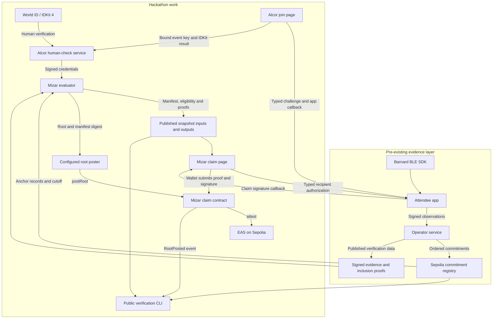

# Mizar

Mizar makes eligibility recomputable from published inputs: an event key must have signed mutual observations with at least N distinct Alcor-credentialed partner keys in at least B time windows per partner, and each claimant needs an Alcor distinct-human credential; this proves satisfaction of the published rule under its evidence and credential trust assumptions, not physical attendance, freedom from relay or collusion, or independent on-chain verification of World ID.

Built for ETHGlobal Tokyo 2026. Hacking started **2026-09-25 21:00 JST**; the submission deadline is **2026-09-27 09:00 JST**.

[Video: TBD](docs/demo/script.md#recording-handoff) — recording and a public video URL are still pending. The [demo script and shot list](docs/demo/script.md) cover a 3 minute 30 second walkthrough.

## How it works

1. **Join and check the person.** The existing attendee app signs a typed challenge with its event key. [Alcor](https://github.com/levarac/alcor) binds that key to a World ID check and publishes a signed credential. The evaluator pins Alcor's signing public key and checks both the service signature and the app signature. Only the first verified key for each nullifier counts for the event.
2. **Collect mutual observations.** The app signs BLE observations. The existing operator service collects them and anchors ordered commitments in the existing Sepolia evidence registry. Mizar checks observation signatures, event context, commitment signatures and observation inclusion proofs. Live evaluation also checks registry records and the commitment-to-block mapping at the snapshot cutoff.
3. **Apply a fixed rule.** An observation pair counts only when both devices report each other's rotating identifiers in the same event, definition and time window. Identifiers claimed by multiple signing keys are dropped. Key pairs accumulate distinct windows; each eligible key needs N credentialed partners with at least B windows **per partner**. The fixture uses N = 2 and B = 2. There is no iterative removal of partners.
4. **Publish a snapshot.** The evaluator writes `manifest.json`, `eligible.json`, `rejected.json` and `proofs/<lowercase-address>.json`. Leaves contain event-key addresses. The configured root poster can post a snapshot root, the SHA-256 digest of the exact manifest bytes and a cutoff block to the claim contract.
5. **Claim individually.** The claim page asks for a recipient wallet and obtains a typed app signature bound to the event, chain, contract and recipient. The contract verifies membership and the signature, permits one claim per event key across snapshots, and calls EAS to issue a non-revocable attestation. Eligibility is batched into a root; each claim is a separate transaction.
6. **Recompute publicly.** Anyone with the published inputs can rerun the evaluator. Offline verification compares against the archived manifest. Chain verification additionally needs independently chosen chain and registry addresses, pre-snapshot parameters obtained outside the archive, and an Alcor credential source. It checks those sources and the `RootPosted` event against the recomputed result.

### What the result does and does not establish

Alcor is a **trusted attester** for the distinct-human check. Mizar verifies its credential signature and event-key binding; it does not rerun World's verification. The contract trusts a deployer-configured poster to choose roots. A Merkle proof establishes membership in a posted root; public recomputation checks whether that root follows the rule. There is no on-chain dispute or challenge mechanism.

Signed observations do not establish physical location or prevent cooperating participants from fabricating or relaying observations. The evidence API's `bundle: null` responses do not expose delegation certificates or allow the committed bundle digest to be rebuilt. Mizar uses the observation's own signing key and makes no delegated-provenance claim from those responses. See [the implementation spec](docs/design/spec.md) and [design decisions](docs/design/decisions.md).

Public inputs expose event keys and their observation relationships. Claiming creates a public event-key-to-wallet link. Anonymous claims are outside this build. Live progress is also unfinished: the supported pending feed is a labeled synthetic fixture, and progress never authorizes a claim.

## Components and source revisions

Source snapshot checked on **2026-09-26 JST**. Links in the components table pin the inspected code. The evaluator is now integrated into Mizar `main` at `787e9b6` and included in this branch. The E2E runner is integrated into Mizar `main` at `2530658`. Alcor is a separate repository.

| Component | Source | Inspected revision / branch | Role |
| --- | --- | --- | --- |
| Claim contract | [contracts/](https://github.com/levarac/mizar/tree/b755abcbdcf7bf61a1ee7f8f93b07695fd1317f7/contracts) | `b755abc`, `main` | Snapshot roots, event-key authorization, one-time claims and EAS issuance |
| Evaluator | [evaluator/](https://github.com/levarac/mizar/tree/787e9b6a27d1f9645b5d7a7997c137b027f5ac86/evaluator) | `787e9b6`, `main`; integrated from `feat/evaluator` at `a7a94a3` | Evidence and credential checks, threshold rule, Merkle outputs and verification CLI |
| Claim page | [web/](https://github.com/levarac/mizar/tree/68cd65e2424bc55572fdf1be36b02ac391a6cfd9/web) | `68cd65e`, `feat/claim-page`; integrated into `main` at `b755abc` | Recipient entry, typed app callback, eligibility/proof loading and wallet submission |
| E2E fixture run | [e2e/](https://github.com/levarac/mizar/tree/c9c7f1d5476dbe523ada877a84b81db1d86d26a1/e2e) | `c9c7f1d`, `feat/e2e-fixture-run`; integrated into `main` at `2530658` | Evaluator-to-claim rehearsal on local Anvil with MockEAS |
| Alcor human-check service | [alcor/worker/](https://github.com/levarac/alcor/tree/7909844bc76c74f35b5266f6849ff744dd84d453/worker) | `7909844`, `feat/human-check-service`; integrated into `main` at `b016899` | World verification, event-key binding, nullifier uniqueness and signed credential list |
| Alcor join page | [alcor/web/](https://github.com/levarac/alcor/tree/7909844bc76c74f35b5266f6849ff744dd84d453/web) | `7909844`, `feat/human-check-service`; integrated into `main` at `b016899` | Challenge, app callback and IDKit 4 human check |

The claim page configuration is still an example. Alcor's example bindings do not enable a live World check. Passing local tests does not establish a deployed or working live join-to-claim flow.

## Architecture



This diagram describes the integration design. The Mizar claim deployment and live web configuration are pending; the local E2E run substitutes Anvil and MockEAS. The app itself is pre-existing; its typed signing entry point is a hackathon integration change.

## Pre-existing work and hackathon contributions

The first Mizar commit is [5da0c79](https://github.com/levarac/mizar/commit/5da0c7907ac292eb9efe6e2281be5dc66fdfddf9), **2026-09-25 23:53:48 JST**. Alcor's first commit is [95da347](https://github.com/levarac/alcor/commit/95da3475db268535a6f39129bc70269a22fe0a77), **2026-09-25 23:53:51 JST**. Both repositories were created after hacking began at 21:00 JST. Repository creation during the event does not make every underlying algorithm new.

Pre-existing parts supplied by the team:

- The entire **Beid** attendee-app repository was pre-existing, including its UI design work. Its repository history at the start of hacking predates **2026-09-25 21:00 JST**. The app records and signs BLE proximity observations.
- The evidence layer was likewise pre-existing as a whole: the operator service, Sepolia evidence contracts and protocol reference implementation all existed before **2026-09-25 21:00 JST**. They collect signed observations, anchor ordered commitment digests with observation inclusion proofs, and derive mutual observation relations. The evaluator's ported files and reimplemented mutual-pair definition follow that reference. The evidence contracts are separate from the new Mizar claim contract.
- [Barnard](https://github.com/levarac/barnard), the public MIT-licensed BLE sensing SDK; [7585339](https://github.com/levarac/barnard/commit/758533956cf3977f0377aed62b5a6f978c56978f), dated **2026-09-22**, is a pre-hackathon revision.

Hackathon work adds Mizar's credential requirement, N/B eligibility threshold and snapshot outputs to the pre-existing mutual-pair definition, along with the claim contract and EAS schema integration, claim page, local E2E runner, and Alcor's human-check service and join page. The pinned revisions in the components table provide the code record.

The app-side typed signing entry point is new hackathon work inside Beid. It becomes open source when the Beid repository is made public; that publication is in preparation. **Public Beid repository link: pending confirmed publication.** The link will be added once publication is confirmed. This README's local checks do not independently verify the app-side integration.

Two evaluator files explicitly carry **Ported from the pre-existing evidence-layer reference** headers, and one function reimplements a pre-existing definition:

- [evaluator/src/codec.ts](https://github.com/levarac/mizar/blob/787e9b6a27d1f9645b5d7a7997c137b027f5ac86/evaluator/src/codec.ts): wire domains and canonical COSE rules.
- [evaluator/src/evidence.ts](https://github.com/levarac/mizar/blob/787e9b6a27d1f9645b5d7a7997c137b027f5ac86/evaluator/src/evidence.ts): observation, commitment and receipt domains, admission fields and inclusion-tree rules.
- [evaluator/src/evaluate.ts](https://github.com/levarac/mizar/blob/787e9b6a27d1f9645b5d7a7997c137b027f5ac86/evaluator/src/evaluate.ts) (`deriveRelations`): the mutual-pair definition, where both reporters list each other's rotating identifier in the same event, definition and time window, follows the pre-existing evidence-layer protocol's relation derivation. The identifier-conflict filter, per-key-pair window accumulation, the N/B threshold, the credential requirement and the snapshot outputs are new.

The contract also vendors upstream EAS and OpenZeppelin dependencies; versions and commit references are listed in [contracts/README.md](contracts/README.md).

## Sepolia deployment

**Not deployed yet.** No Mizar claim-contract address or registered Mizar schema UID is available for this submission snapshot.

| Item | Status |
| --- | --- |
| Mizar claim contract address | Not deployed yet |
| Mizar EAS schema UID | Not registered yet |
| Public root / claim transaction | Pending deployment and an approved live run |

The existing evidence-layer registry is a separate deployment. Local Anvil addresses printed by the E2E runner are not Sepolia deployments.

The exact preparation scripts are [`contracts/script/RegisterSchema.s.sol:RegisterSchema`](contracts/script/RegisterSchema.s.sol) and [`contracts/script/Deploy.s.sol:Deploy`](contracts/script/Deploy.s.sol). The former registers `bytes32 eventId, address eventKey, uint64 snapshotId, bytes32 manifestDigest` with no resolver and `revocable = false`; the latter deploys the claim contract. [Deployment instructions](contracts/README.md#deployment-commands-not-run) are separate from the local checks below. Neither script was broadcast for this documentation work.

## Local build and verification

Requirements: **Node.js 22+**, pnpm and Foundry (`forge`, `anvil`). Contract, evaluator, claim-page and E2E commands run from a Mizar checkout containing `main` revision `2530658`, including this branch. Each block starts from its repository root. Alcor uses its own repository.

For a pinned Mizar checkout: `git clone https://github.com/levarac/mizar mizar`, then `git -C mizar checkout 2530658`. The evaluator and E2E runner no longer need separate feature-branch checkouts.

### Contract

```sh
cd contracts
forge build
env -u SEPOLIA_RPC_URL forge test -vv
```

This runs local contract tests. Removing `SEPOLIA_RPC_URL` makes the optional Sepolia fork test explicitly skip; no live contract is tested or changed.

### Evaluator: fixture-only reproduction

```sh
cd evaluator
pnpm install --frozen-lockfile
pnpm test
pnpm typecheck
pnpm mizar evaluate --params test/fixtures/params.json --out /tmp/mizar-readme-out-latest
pnpm mizar verify --manifest /tmp/mizar-readme-out-latest/manifest.json
```

The checked-in inputs contain synthetic observations, credentials and anchor mappings. Their public deterministic test keys are not event credentials. Offline `PASS` establishes consistency with the poster-supplied archive, including its parameters, credential list and block mapping; it does not prove that those inputs are complete or that a root or input was anchored on Sepolia.

Live chain verification is a separate mode requiring `--rpc`, `--contract`, `--chain-id`, `--event-registry`, `--definition-registry`, `--commitment-registry` and `--trusted-params`. The verifier must independently choose the chain and registry addresses and obtain the parameters published before the snapshot from outside the manifest's archive. An archived parameters file is refused as a trust source.

Optional flags are `--trusted-params-sha256` to check those parameters against an independently obtained digest, `--credentials-source` to override the Alcor list location in the trusted parameters, and `--from-block` to set a trusted lower bound for log reads (default 0). Verification checks that credential entries that verify and were verified by the cutoff are not omitted, rechecks evidence anchors and cutoff data, and compares the posted root and manifest digest. The organizer's parameters publication location and independent digest remain undecided.

Missing or unavailable verifier-selected context produces `UNAVAILABLE`; invalid archive contents and checked archive mismatches produce `FAIL`. A mismatch between the verifier's parameter copy and its optional expected digest is `UNAVAILABLE`. See the [current evaluator README](https://github.com/levarac/mizar/blob/787e9b6a27d1f9645b5d7a7997c137b027f5ac86/evaluator/README.md) for the complete command and trust assumptions. Live chain verification was not run for this document.

### Claim page

```sh
cd web
pnpm install --frozen-lockfile
pnpm test
pnpm build
```

These are local tests and a static build. `web/src/config.ts` contains example values and must be configured for a real event. A successful build is not a verified app callback or wallet transaction.

### Local E2E: fixture-only, Anvil and MockEAS

```sh
cd e2e
pnpm install --frozen-lockfile
pnpm e2e
```

The runner builds the contracts, installs the evaluator dependencies, evaluates the fixture, starts a local Anvil chain, posts a root, claims, and checks MockEAS output. It checks duplicate-claim and wrong-recipient rejection, the signing golden vector, offline verification, and the local `RootPosted` log. It does not exercise the browser, the attendee app, World ID or Sepolia. Using chain ID 11155111 on Anvil does not make this a Sepolia run.

### Alcor Worker: mocked World verification

Run from the Alcor checkout at the revision above:

```sh
cd worker
pnpm install --frozen-lockfile
pnpm test
pnpm typecheck
```

If a parent directory contains a pnpm workspace, add `--ignore-workspace` to the Alcor Worker install.

The tests use local Miniflare D1 and an injected World verification client. The proof fixtures are documentation-shaped mocks, not captured live World proofs. See [Alcor's Worker README](https://github.com/levarac/alcor/blob/7909844bc76c74f35b5266f6849ff744dd84d453/worker/README.md) for the live configuration still required.

### Observed local results

These historical local runs were executed on 2026-09-26 JST using Node.js 24.16.0 and Foundry 1.7.1. The table identifies the actual tested revisions. The evaluator results are from `eae54bc`, before the later changes integrated into `main` at `787e9b6`; builds and tests were not rerun for this documentation update. These results cover source-level local verification only.

| Check | Observed result |
| --- | --- |
| Contract build / tests | Exit 0 / exit 0; 13 passed, 0 failed, 1 optional fork test skipped at `b755abc` |
| Evaluator tests / typecheck | Exit 0 / exit 0; 20 tests passed at `eae54bc` |
| Fixture evaluate / offline verify | Exit 0 / exit 0; 4 eligible, 4 rejected, 1 invalid observation; `PASS` at `eae54bc` |
| Claim-page tests / build | Exit 0 / exit 0; 9 tests passed at `68cd65e` |
| Local E2E | Exit 0; all six reported checks passed at `c9c7f1d` |
| Alcor Worker tests / typecheck | Exit 0 / exit 0; 9 tests passed at `7909844` |

All four dependency installs for those tested revisions completed with exit 0. No live World proof, real-device interaction, Sepolia deployment or live claim was verified by these checks.

## Sponsor API usage

| Integration | Exact source paths | What the code does |
| --- | --- | --- |
| World ID / IDKit 4 | Alcor [`web/main.ts`](https://github.com/levarac/alcor/blob/7909844bc76c74f35b5266f6849ff744dd84d453/web/main.ts), [`web/package.json`](https://github.com/levarac/alcor/blob/7909844bc76c74f35b5266f6849ff744dd84d453/web/package.json) | Pins `@worldcoin/idkit-core` 4.3.0; calls `IDKit.request` with signed `rp_context`, `allow_legacy_proofs: false` and `proofOfHuman({ signal })`, then polls for the result |
| World verification and RP signing | Alcor [`worker/src/index.ts`](https://github.com/levarac/alcor/blob/7909844bc76c74f35b5266f6849ff744dd84d453/worker/src/index.ts), [`worker/package.json`](https://github.com/levarac/alcor/blob/7909844bc76c74f35b5266f6849ff744dd84d453/worker/package.json) | Uses IDKit `signRequest` and `hashSignal`; forwards the result to `POST https://developer.world.org/api/v4/verify/{rp_id}` and checks action, environment, signal and nullifier before issuing a credential |
| Ethereum Attestation Service | [`contracts/src/MizarClaim.sol`](contracts/src/MizarClaim.sol) | Calls `IEAS.attest` after proof and signature checks, with the recipient and encoded event ID, event key, snapshot ID and manifest digest |
| EAS SchemaRegistry | [`contracts/script/RegisterSchema.s.sol`](contracts/script/RegisterSchema.s.sol) | Calls `ISchemaRegistry.register` with the fixed non-revocable schema and no resolver |

The Alcor integration above was checked at `feat/human-check-service` revision `7909844`, now integrated into Alcor `main` at `b016899`; the EAS contract integration is on Mizar `main`. API integration code and mocked tests are not evidence of successful live sponsor API use.

## AI tool disclosure

Development used AI coding agents: Claude Code with Claude Opus, OpenAI Codex, Grok and Devin. The specifications and design decisions that directed the agents are in [docs/design/](docs/design/). Team members set the rule, design and scope, and reviewed each branch with a separate AI agent before integration.

The [development prompts and planning artifacts](docs/process/) preserve sanitized implementation instructions, review checklists and corrections, with a mapping from each prompt to its component. They are historical instructions, not a record that every requested check passed.

## License

[MIT](LICENSE).
